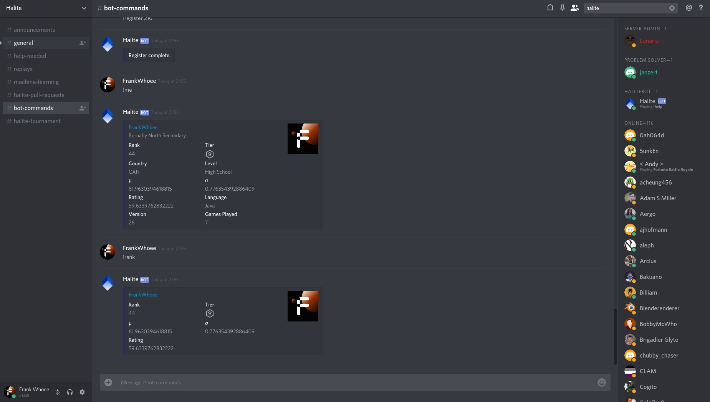

# HaliteBot

This is the unofficial, but used Discord bot for the official Halite server for Halite III!

## Features
It has several useful commands for feeding your Halite addiction:

* !who `<user_id>`
  * This command returns information about the Halite account associated with <user_id>. For example, rank, level, language, games played, country, etc.
  * Example: `!who 216`
* !rank `<[OFR]user_id>`
  * This command returns rank information for the associated <[OFR]user_id> account, like rank, mu, sigma, tier, etc.
  * Example: `!rank 206`
* !register `<user_id>`
  * Tired of typing your user ID all the time? You can register to use OFR functions. OFR means Optional For Registered people. Halite Bot will store your user id in a json database so you can check your stats without typing your user id all the time.
  * Example: `!register 326`
* !me
  * This command gives you your stats, if you're registered. Less typing! But only if you're registered.
* !top `<list_size>`
  * This handy command tells you who is in the top right now. `<list_size>` is how many players that you want to list.
  * Example: `!top 5`
  
